# Syntrix AI - AWS Prior Authorization System - Visual Architecture

> **Viewing Tip**: Open this file in GitHub or paste diagrams into [mermaid.live](https://mermaid.live) for interactive viewing and export.

---

## High-Level Overview (Simple)

```mermaid
flowchart LR
    A[👤 User] --> B[🌐 Next.js<br/>Frontend]
    B --> C[⚡ Lambda<br/>Functions]
    C --> D[🤖 Bedrock<br/>AI]
    C --> E[💾 S3 +<br/>DynamoDB]
    C --> F[🌍 External<br/>APIs]
    
    style A fill:#e1f5ff,stroke:#0288d1,stroke-width:3px
    style B fill:#4CAF50,stroke:#2e7d32,stroke-width:3px,color:#fff
    style C fill:#FF9900,stroke:#f57c00,stroke-width:3px,color:#fff
    style D fill:#FF6F00,stroke:#e65100,stroke-width:3px,color:#fff
    style E fill:#4285F4,stroke:#1565c0,stroke-width:3px,color:#fff
    style F fill:#9E9E9E,stroke:#616161,stroke-width:2px
```



**Flow**: User uploads note → Lambda extracts data with AI → Validates codes → Checks evidence → AI reviews → Stores result

---

## System Architecture Diagram (Detailed)

```mermaid
flowchart TD
    U[👤 Healthcare Staff] -->|HTTPS| NX

    subgraph Frontend["🌐 Frontend Layer"]
        NX[Next.js Application<br/>React + TypeScript]
    end

    subgraph AWS["☁️ AWS Cloud - us-east-1"]
        direction TB
        
        subgraph Storage["💾 Storage Layer"]
            S3[S3 Buckets<br/>Clinical Notes + Evidence]
            DDB[(DynamoDB<br/>pa-agent-cases)]
        end

        subgraph Compute["⚡ Compute Layer"]
            direction LR
            L1[Extraction<br/>Agent]
            L2[Orchestrator]
            L3[Code<br/>Validator]
            L4[Evidence<br/>Checker]
            L5[Payer<br/>API]
        end

        subgraph AI["🤖 AI Services"]
            BR[Amazon Bedrock<br/>Nova Pro v1.0]
            BA[Bedrock Agent<br/>Orchestration]
        end
    end

    EXT[🌍 NIH API<br/>ICD-10 Validation]

    NX -->|1. Upload| S3
    NX -->|2. Extract| L1
    L1 --> BR
    L1 --> DDB
    
    NX -->|3. Orchestrate| L2
    L2 --> BA
    L2 --> L3
    L2 --> L4
    L2 --> L5
    
    L3 --> EXT
    L3 --> BR
    L4 --> S3
    L5 --> BR
    
    L2 --> DDB
    NX -.->|Query| DDB

    style U fill:#e1f5ff,stroke:#0288d1,stroke-width:2px
    style NX fill:#4CAF50,stroke:#2e7d32,stroke-width:3px,color:#fff
    style S3 fill:#569A31,stroke:#33691e,stroke-width:2px,color:#fff
    style DDB fill:#4285F4,stroke:#1565c0,stroke-width:2px,color:#fff
    style BR fill:#FF6F00,stroke:#e65100,stroke-width:3px,color:#fff
    style BA fill:#FF9800,stroke:#ef6c00,stroke-width:2px,color:#fff
    style L1 fill:#FF9900,stroke:#f57c00,stroke-width:2px,color:#fff
    style L2 fill:#FF9900,stroke:#f57c00,stroke-width:2px,color:#fff
    style L3 fill:#FF9900,stroke:#f57c00,stroke-width:2px,color:#fff
    style L4 fill:#FF9900,stroke:#f57c00,stroke-width:2px,color:#fff
    style L5 fill:#FF9900,stroke:#f57c00,stroke-width:2px,color:#fff
    style EXT fill:#9E9E9E,stroke:#616161,stroke-width:2px
    
    style Storage fill:#f5f5f5,stroke:#bdbdbd,stroke-width:2px
    style Compute fill:#fff3e0,stroke:#ffb74d,stroke-width:2px
    style AI fill:#fce4ec,stroke:#f48fb1,stroke-width:2px
    style AWS fill:#e3f2fd,stroke:#64b5f6,stroke-width:3px
    style Frontend fill:#e8f5e9,stroke:#81c784,stroke-width:2px
```



---

## Detailed Component Flow


---

## AI Assistant (Chat) Architecture

```mermaid
flowchart LR
    User[👤 User] -->|Question| Chat
    
    subgraph Frontend["Frontend"]
        Chat[💬 Chat UI]
    end
    
    subgraph Backend["Next.js API"]
        API[Chat API<br/>Bedrock Converse]
    end
    
    subgraph AI["AI Layer"]
        Nova[🤖 Nova Pro<br/>Tool Calling]
    end
    
    subgraph Tools["Available Tools"]
        T1[📊 Query Cases]
        T2[📄 Get Details]
        T3[📈 Statistics]
    end
    
    DB[(💾 DynamoDB)]
    
    Chat --> API
    API <--> Nova
    Nova -.->|Tool Call| API
    API --> Tools
    Tools --> DB
    API -->|Response| Chat

    style User fill:#e1f5ff,stroke:#0288d1,stroke-width:2px
    style Chat fill:#4CAF50,stroke:#2e7d32,stroke-width:2px,color:#fff
    style API fill:#2196F3,stroke:#1565c0,stroke-width:2px,color:#fff
    style Nova fill:#FF6F00,stroke:#e65100,stroke-width:2px,color:#fff
    style DB fill:#4285F4,stroke:#1565c0,stroke-width:2px,color:#fff
    style Tools fill:#9C27B0,stroke:#6a1b9a,stroke-width:2px,color:#fff
```



---

## Lambda Function Workflow (Step Functions Style)


---

## Data Model (DynamoDB)


---

## Security & Access Architecture

```mermaid
flowchart TD
    User[👤 Healthcare Users]
    
    subgraph Security["🔐 Security Layer"]
        IAM[IAM Roles<br/>Least Privilege]
        KMS[KMS Encryption<br/>Optional]
        CW[CloudWatch Logs]
    end
    
    subgraph Compute["⚡ Compute"]
        Lambda[Lambda Functions<br/>7 Functions]
    end
    
    subgraph Storage["💾 Storage"]
        S3[S3 Buckets<br/>SSE Encryption]
        DDB[DynamoDB<br/>Encrypted at Rest]
    end
    
    subgraph AI["🤖 AI"]
        BR[Bedrock<br/>TLS 1.2+]
    end
    
    External[🌍 External APIs<br/>NIH]
    
    User -->|HTTPS| Lambda
    IAM -.->|Controls| Lambda
    IAM -.->|Controls| S3
    IAM -.->|Controls| DDB
    KMS -.->|Encrypts| S3
    KMS -.->|Encrypts| DDB
    Lambda --> S3
    Lambda --> DDB
    Lambda --> BR
    Lambda --> External
    Lambda -.->|Logs| CW

    style User fill:#e1f5ff,stroke:#0288d1,stroke-width:2px
    style Lambda fill:#FF9900,stroke:#f57c00,stroke-width:2px,color:#fff
    style S3 fill:#569A31,stroke:#33691e,stroke-width:2px,color:#fff
    style DDB fill:#4285F4,stroke:#1565c0,stroke-width:2px,color:#fff
    style BR fill:#FF6F00,stroke:#e65100,stroke-width:2px,color:#fff
    style IAM fill:#DD344C,stroke:#c62828,stroke-width:2px,color:#fff
    style KMS fill:#DD344C,stroke:#c62828,stroke-width:2px,color:#fff
    style CW fill:#FF9800,stroke:#ef6c00,stroke-width:2px,color:#fff
    style External fill:#9E9E9E,stroke:#616161,stroke-width:2px
```



---

## Cost Breakdown


---

## Deployment Pipeline


---

## How to Create Professional AWS Architecture Diagram

### Option 1: AWS Architecture Icons (Official)
Download from: https://aws.amazon.com/architecture/icons/

**Tools**:
1. **draw.io / diagrams.net** (Free)
   - Import AWS icon library
   - Drag and drop components
   - Export as PNG/SVG/PDF

2. **Lucidchart** (Free tier available)
   - Built-in AWS shapes
   - Collaboration features
   - Professional templates

3. **CloudCraft** (Free for basic)
   - 3D AWS diagrams
   - Cost estimation
   - Live AWS sync

### Option 2: Code-based Diagrams

**Diagrams as Code** (Python):
```bash
pip install diagrams
```

Create `architecture_diagram.py`:
```python
from diagrams import Cluster, Diagram
from diagrams.aws.compute import Lambda
from diagrams.aws.database import DynamoDB
from diagrams.aws.storage import S3
from diagrams.aws.ml import Bedrock
from diagrams.aws.security import IAM

with Diagram("PA System", show=False, direction="TB"):
    with Cluster("Frontend"):
        nextjs = Lambda("Next.js")
    
    with Cluster("AWS Services"):
        with Cluster("Lambda Functions"):
            extract = Lambda("Extraction")
            orch = Lambda("Orchestrator")
            validator = Lambda("Validator")
        
        s3 = S3("Clinical Notes")
        ddb = DynamoDB("Cases")
        bedrock = Bedrock("Nova Pro")
        iam = IAM("Roles")
    
    nextjs >> s3 >> extract >> bedrock
    extract >> ddb
    nextjs >> orch >> [validator, bedrock, ddb]
```

Run: `python architecture_diagram.py`

### Option 3: Mermaid Live Editor
https://mermaid.live/

Paste the Mermaid diagrams from this document and export as SVG/PNG.

---

## Quick Reference

| Component | AWS Service | Purpose |
|-----------|-------------|---------|
| Frontend | Next.js (self-hosted) | Web application |
| API Layer | Lambda Functions (7) | Serverless compute |
| Storage | S3 (3 buckets) | Object storage |
| Database | DynamoDB (1 table) | NoSQL data store |
| AI Engine | Bedrock Nova Pro | Generative AI |
| Orchestration | Bedrock Agent (optional) | Workflow automation |
| Security | IAM Roles | Access control |
| Monitoring | CloudWatch | Logs & metrics |

---

**Export Instructions**:

1. Copy Mermaid diagrams to https://mermaid.live/
2. Adjust styling and layout
3. Export as PNG (300 DPI) or SVG
4. Use in presentations, documentation, wiki

**For Professional Diagrams**:
- Use official AWS icons
- Follow AWS architecture best practices
- Add legend for custom icons
- Include region information
- Show security boundaries
- Label all connections

---

**Document Version**: 2.0  
**Format**: Mermaid (GitHub-compatible, Simplified)  
**Last Updated**: 2025-10-22  
**Changes**: Reduced diagram complexity, cleaner layouts, added high-level overview

