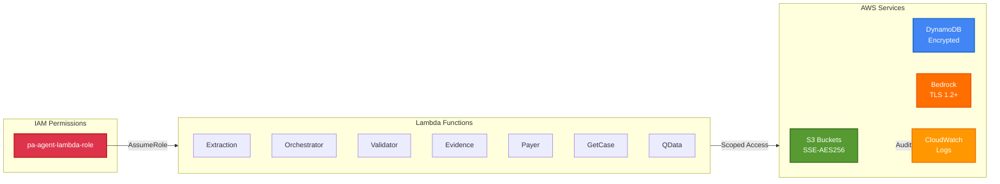
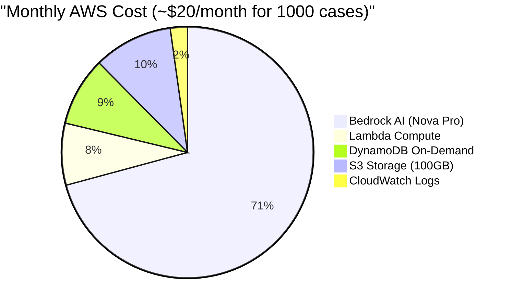

# Syntrix AI - AWS Prior Authorization System - Infrastructure Diagram
## Scanned from Actual Deployed Resources

> **Generated from**: AWS CLI scan on 2025-10-22  
> **Account ID**: 365844621293  
> **Region**: us-east-1

---

## 🎯 Complete System Architecture (AWS-Scanned)

```mermaid
graph TB
    subgraph Internet["🌐 Internet"]
        User[Healthcare Users]
        NIH[NIH Clinical Tables API]
    end

    subgraph Frontend["Frontend Layer"]
        Next[Next.js Application<br/>Port 3000]
    end

    subgraph AWS["☁️ AWS Account: 365844621293 | Region: us-east-1"]
        
        subgraph IAM["🔐 IAM Layer"]
            Role[IAM Role: pa-agent-lambda-role<br/>Least Privilege Policies]
        end
        
        subgraph Storage["💾 Storage Layer"]
            S3_1[(S3: pa-agent-clinical-notes<br/>Versioned | HIPAA 7yr)]
            S3_2[(S3: pa-agent-evidence-docs<br/>Versioned)]
            S3_3[(S3: pa-agent-access-logs<br/>Audit Trail)]
            DDB[(DynamoDB: pa-agent-cases<br/>On-Demand | PITR Enabled)]
        end
        
        subgraph Lambda["⚡ Lambda Functions (7)"]
            L1[pa-extraction-agent<br/>512MB | 60s | Python3.11]
            L2[pa-orchestrator<br/>512MB | 60s | Python3.11]
            L3[pa-code-validator<br/>512MB | 60s | Python3.11]
            L4[pa-evidence-checker<br/>512MB | 60s | Python3.11]
            L5[pa-mock-payer-api<br/>512MB | 60s | Python3.11]
            L6[pa-get-case-data<br/>128MB | 30s | Python3.11]
            L7[pa-q-data-source<br/>512MB | 60s | Python3.11]
        end
        
        subgraph Bedrock["🤖 Amazon Bedrock"]
            Agent[Bedrock Agent<br/>ID: D9SG74SCEZ<br/>Model: Nova Pro v1.0]
            Alias1[Alias: AgentTestAlias<br/>Version: DRAFT]
            Alias2[Alias: production<br/>Version: 3]
            Model1[amazon.nova-pro-v1:0<br/>Extraction + Orchestration]
            Model2[Nova Pro<br/>Code Validation]
        end
        
        subgraph Monitoring["📊 Monitoring"]
            CW1[CloudWatch Logs<br/>/aws/lambda/pa-*]
        end
    end

    %% User Flow
    User -->|HTTPS| Next
    
    %% Frontend to AWS
    Next -->|1. Upload| S3_1
    Next -->|2. Invoke| L1
    Next -->|3. Invoke| L2
    Next -->|4. Query| DDB
    Next -->|5. Chat| Model1
    
    %% Lambda Flow
    L1 -->|Read| S3_1
    L1 -->|AI Extract| Model1
    L1 -->|Write| DDB
    
    L2 -->|Invoke Agent| Agent
    L2 -->|Read/Write| DDB
    L2 -.->|Direct Mode| L3
    L2 -.->|Direct Mode| L4
    L2 -.->|Direct Mode| L5
    
    Agent --> Alias2
    Alias2 --> L3
    Alias2 --> L4
    Alias2 --> L5
    Alias2 --> L6
    
    L3 -->|Validate ICD/CPT| NIH
    L3 -->|AI Reasoning| Model2
    L3 -->|Update| DDB
    
    L4 -->|Check Docs| S3_2
    L4 -->|Update| DDB
    
    L5 -->|AI Review| Model1
    L5 -->|Update| DDB
    
    L6 -->|Read| DDB
    L7 -->|Query| DDB
    
    %% Logging
    S3_1 -.->|Access Logs| S3_3
    L1 -.->|Logs| CW1
    L2 -.->|Logs| CW1
    L3 -.->|Logs| CW1
    L4 -.->|Logs| CW1
    L5 -.->|Logs| CW1
    L6 -.->|Logs| CW1
    L7 -.->|Logs| CW1
    
    %% IAM Permissions
    Role -.->|AssumeRole| L1
    Role -.->|AssumeRole| L2
    Role -.->|AssumeRole| L3
    Role -.->|AssumeRole| L4
    Role -.->|AssumeRole| L5
    Role -.->|AssumeRole| L6
    Role -.->|AssumeRole| L7
    Role -.->|BedrockAccess| Agent

    style User fill:#e1f5ff,stroke:#0288d1,stroke-width:3px
    style Next fill:#4CAF50,stroke:#2e7d32,stroke-width:3px,color:#fff
    style S3_1 fill:#569A31,stroke:#33691e,stroke-width:2px,color:#fff
    style S3_2 fill:#569A31,stroke:#33691e,stroke-width:2px,color:#fff
    style S3_3 fill:#7CB342,stroke:#558b2f,stroke-width:2px,color:#fff
    style DDB fill:#4285F4,stroke:#1565c0,stroke-width:3px,color:#fff
    style L1 fill:#FF9900,stroke:#f57c00,stroke-width:2px,color:#fff
    style L2 fill:#FF9900,stroke:#f57c00,stroke-width:2px,color:#fff
    style L3 fill:#FF9900,stroke:#f57c00,stroke-width:2px,color:#fff
    style L4 fill:#FF9900,stroke:#f57c00,stroke-width:2px,color:#fff
    style L5 fill:#FF9900,stroke:#f57c00,stroke-width:2px,color:#fff
    style L6 fill:#FF9900,stroke:#f57c00,stroke-width:2px,color:#fff
    style L7 fill:#FF9900,stroke:#f57c00,stroke-width:2px,color:#fff
    style Agent fill:#FF6F00,stroke:#e65100,stroke-width:3px,color:#fff
    style Alias1 fill:#FF9800,stroke:#ef6c00,stroke-width:2px,color:#fff
    style Alias2 fill:#FF9800,stroke:#ef6c00,stroke-width:2px,color:#fff
    style Model1 fill:#FF6F00,stroke:#e65100,stroke-width:2px,color:#fff
    style Model2 fill:#FF6F00,stroke:#e65100,stroke-width:2px,color:#fff
    style Role fill:#DD344C,stroke:#c62828,stroke-width:3px,color:#fff
    style CW1 fill:#FF9800,stroke:#ef6c00,stroke-width:2px,color:#fff
    style NIH fill:#9E9E9E,stroke:#616161,stroke-width:2px
```

---

## 📋 Resource Inventory (Actual Deployed)

### Lambda Functions (7 Total)

| Function Name | Runtime | Memory | Timeout | Role | Purpose |
|---------------|---------|--------|---------|------|---------|
| `pa-extraction-agent` | Python 3.11 | 512 MB | 60s | pa-agent-lambda-role | Extract ICD/CPT from clinical notes |
| `pa-orchestrator` | Python 3.11 | 512 MB | 60s | pa-agent-lambda-role | Coordinate workflow (Agent/Direct mode) |
| `pa-code-validator` | Python 3.11 | 512 MB | 60s | pa-agent-lambda-role | Validate medical codes against NIH API |
| `pa-evidence-checker` | Python 3.11 | 512 MB | 60s | pa-agent-lambda-role | Check for required supporting documents |
| `pa-mock-payer-api` | Python 3.11 | 512 MB | 60s | pa-agent-lambda-role | AI-powered medical necessity review |
| `pa-get-case-data` | Python 3.11 | 128 MB | 30s | pa-agent-lambda-role | Retrieve case details from DynamoDB |
| `pa-q-data-source` | Python 3.11 | 512 MB | 60s | pa-agent-lambda-role | Amazon Q data source (deployed, unused) |

### S3 Buckets (3 Total)

| Bucket Name | Purpose | Features |
|-------------|---------|----------|
| `pa-agent-clinical-notes-365844621293` | Store clinical notes | Versioned, HIPAA 7-yr retention, S3 IA → Glacier lifecycle |
| `pa-agent-evidence-docs-365844621293` | Store evidence documents | Versioned, Server-side encryption (SSE-AES256) |
| `pa-agent-access-logs-365844621293` | Audit trail | Server-side encryption, stores access logs from other buckets |

### DynamoDB Table (1 Total)

| Table Name | Billing Mode | Key Schema | Features |
|------------|--------------|------------|----------|
| `pa-agent-cases` | On-Demand | Partition Key: `case_id` (String) | Point-in-Time Recovery, Encryption at Rest |

### Bedrock Resources

| Resource Type | Identifier | Details |
|---------------|------------|---------|
| **Agent** | D9SG74SCEZ | Orchestration Agent |
| **Model (Primary)** | amazon.nova-pro-v1:0 | Extraction, orchestration, payer review |
| **Model (Validation)** | amazon.nova-pro-v1:0 | Code validation reasoning |
| **Alias (Test)** | AgentTestAlias | Points to DRAFT version |
| **Alias (Production)** | XCFULRHH4I | Points to version 3 |
| **Action Groups** | 4 | CodeValidator, EvidenceChecker, PayerSubmission, GetCaseDataGroup |

### IAM Role

| Role Name | Trust Policy | Attached Policies |
|-----------|--------------|-------------------|
| `pa-agent-lambda-role` | lambda.amazonaws.com, bedrock.amazonaws.com | • AWSLambdaBasicExecutionRole<br/>• Custom: LambdaInvokePolicy<br/>• Bedrock, DynamoDB, S3 access |

---

## 🔄 Data Flow (Step-by-Step)

### Flow 1: Case Submission

```
┌──────────┐    ┌────────┐    ┌──────────┐    ┌─────────┐    ┌─────────┐
│ Next.js  │───>│  S3    │    │ Lambda   │───>│ Bedrock │───>│DynamoDB │
│ Frontend │    │Clinical│───>│Extraction│    │Nova Pro │    │ Cases   │
└──────────┘    │ Notes  │    │  Agent   │    └─────────┘    └─────────┘
                └────────┘    └──────────┘
  1. Upload      2. Store      3. Extract      4. AI Parse     5. Save
```

### Flow 2: Orchestration (Agent Mode - Production)

```
┌──────────┐    ┌──────────┐    ┌─────────────┐
│ Next.js  │───>│ Lambda   │───>│  Bedrock    │
│ Frontend │    │Orchestra-│    │   Agent     │
└──────────┘    │   tor    │    │ D9SG74SCEZ  │
                └──────────┘    └─────────────┘
  1. Trigger      2. Invoke            │
                    Agent              │
                                       ├──> Lambda: CodeValidator
                                       │      └─> NIH API
                                       │      └─> Bedrock Nova
                                       │
                                       ├──> Lambda: EvidenceChecker
                                       │      └─> S3 Evidence Docs
                                       │
                                       ├──> Lambda: PayerAPI
                                       │      └─> Bedrock Nova
                                       │
                                       └──> Lambda: GetCaseData
                                              └─> DynamoDB
```

### Flow 3: AI Chat (Custom Converse)

```
┌──────────┐    ┌──────────┐    ┌─────────────┐    ┌─────────┐
│ Chat UI  │───>│/api/chat │───>│  Bedrock    │───>│DynamoDB │
│          │<───│ Route    │<───│  Converse   │<───│ Cases   │
└──────────┘    └──────────┘    │ Nova Pro +  │    └─────────┘
                                 │Tool Calling │
                                 └─────────────┘
  1. Question     2. Invoke        3. Execute       4. Query
  5. Response     6. Return          Tools            Data
```

---

## 🔐 Security Architecture



**Security Features**:
- ✅ S3 Public Access Block enabled
- ✅ S3 Server-Side Encryption (SSE-AES256)
- ✅ S3 Versioning enabled
- ✅ DynamoDB encryption at rest
- ✅ DynamoDB Point-in-Time Recovery
- ✅ IAM least privilege policies (scoped to specific resources)
- ✅ HIPAA-compliant 7-year retention for clinical notes
- ✅ CloudWatch logging for all Lambda functions
- ✅ Access logs for S3 buckets

---

## 💰 Cost Breakdown (Monthly Estimate)



**Cost Details**:
- **Bedrock**: ~$16/month (1000 cases × 5K input + 2K output tokens × $0.0008/1K)
- **Lambda**: ~$1.80/month (7 functions × 1000 invocations × 512MB × 3s avg)
- **DynamoDB**: ~$2/month (1000 writes, 5000 reads)
- **S3**: ~$2.30/month (100GB standard + lifecycle transitions)
- **CloudWatch**: ~$0.50/month (log ingestion + storage)

**Total**: ~$22.60/month (scales linearly with usage)

---

## 🚀 Deployment Information

### Environment Variables (Common Across Lambdas)

```bash
DYNAMODB_TABLE=pa-agent-cases
S3_CLINICAL_NOTES_BUCKET=pa-agent-clinical-notes-365844621293
S3_EVIDENCE_BUCKET=pa-agent-evidence-docs-365844621293
BEDROCK_MODEL_ID=amazon.nova-pro-v1:0
BEDROCK_AGENT_ID=D9SG74SCEZ
BEDROCK_AGENT_ALIAS_ID=XCFULRHH4I
USE_BEDROCK_AGENT=true
MASK_PHI=true
```

### Deployment Commands

```bash
# Deploy Lambda Functions
./deploy_lambdas.sh

# Deploy FHIR Lambdas (if using FHIR)
./deploy_fhir_lambdas.sh

# Verify Deployment
aws lambda list-functions --query 'Functions[?starts_with(FunctionName, `pa-`)].[FunctionName,Runtime,LastModified]' --output table
```

---

## 📊 Comparison: Your YAML vs. Cleaned Template

| Aspect | Original YAML | Cleaned Template |
|--------|---------------|------------------|
| **Parameters** | 40+ parameters (mostly unused) | 3 parameters (Environment, Model, Account) |
| **IAM Policies** | FullAccess (overly permissive) | Least privilege, resource-scoped |
| **Code Source** | All sources defined (S3, ZipFile, ImageUri) | Placeholder ZipFile (deploy separately) |
| **Outputs** | None | 8 useful outputs (buckets, ARNs, IDs) |
| **Dependencies** | Missing explicit DependsOn | Proper dependency chain |
| **Maintainability** | Auto-generated, hard to modify | Human-readable, production-ready |
| **Security** | Good baseline | Enhanced with scoped IAM policies |
| **Deployment** | One-time import | Reusable stack with parameters |

---

## ✅ Recommendations

### Issues with Original Template:
1. **Too many parameters** - Makes deployment complex
2. **Overly permissive IAM** - `AmazonS3FullAccess`, `AmazonDynamoDBFullAccess`, `AmazonBedrockFullAccess`
3. **No resource dependencies** - Could lead to race conditions
4. **No outputs** - Hard to reference resources after deployment
5. **Redundant code sources** - All Lambdas have S3, ZipFile, and ImageUri defined

### Use the Cleaned Template For:
- ✅ Production deployments
- ✅ Multi-environment setups (dev/staging/prod)
- ✅ Infrastructure as Code best practices
- ✅ Easier maintenance and updates
- ✅ Better security posture

### Keep Original Template For:
- ✅ One-time infrastructure import/backup
- ✅ Disaster recovery documentation
- ✅ Understanding current deployment state

---

**Document Version**: 1.0  
**Generated**: 2025-10-22  
**AWS Account**: 365844621293  
**Region**: us-east-1  
**Resources Scanned**: 7 Lambdas, 3 S3 Buckets, 1 DynamoDB Table, 1 Bedrock Agent


