# Syntrix AI - Complete Data Flow - User to Frontend to AWS

## 🔄 Full Request/Response Flow with Payloads

### Flow 1: Complete Case Submission Journey

```mermaid
sequenceDiagram
    participant User as 👤 Healthcare Staff
    participant Browser as 🌐 Web Browser
    participant Next as Next.js Frontend<br/>(Port 3000)
    participant S3 as ☁️ S3<br/>Clinical Notes
    participant Lambda1 as ⚡ Lambda<br/>Extraction Agent
    participant Bedrock as 🤖 Bedrock<br/>Nova Pro
    participant DDB as 💾 DynamoDB<br/>Cases Table

    Note over User,DDB: 📤 STEP 1: Upload Clinical Note

    User->>Browser: Click "Upload Note"
    Browser->>User: Show file picker
    User->>Browser: Select file (clinical_note.txt)
    
    Browser->>Next: POST /api/upload<br/>FormData{file: clinical_note.txt}
    Note right of Next: Content: "Patient John Doe,<br/>Diagnosis: CAD,<br/>Procedure: CABG..."
    
    Next->>S3: PutObject()<br/>Bucket: pa-agent-clinical-notes<br/>Key: notes/2025-10-22_note.txt
    S3-->>Next: 200 OK<br/>{ETag: "abc123", VersionId: "v1"}
    
    Next->>Lambda1: Invoke()<br/>FunctionName: pa-extraction-agent<br/>Payload: {bucket, key}
    
    Lambda1->>S3: GetObject()<br/>Bucket: pa-agent-clinical-notes<br/>Key: notes/2025-10-22_note.txt
    S3-->>Lambda1: 200 OK<br/>Body: <clinical note text>
    
    Lambda1->>Bedrock: InvokeModel()<br/>Model: amazon.nova-pro-v1:0<br/>Prompt: "Extract ICD-10, CPT..."
    Note right of Bedrock: Processing with AI...
    Bedrock-->>Lambda1: 200 OK<br/>{<br/>  patient_name: "John Doe",<br/>  diagnosis: "CAD",<br/>  ICD10: ["I25.10"],<br/>  CPT: ["33510"],<br/>  summary: "CABG procedure..."<br/>}
    
    Lambda1->>DDB: PutItem()<br/>Table: pa-agent-cases<br/>Item: {<br/>  case_id: "uuid-123",<br/>  patient_name: "John Doe",<br/>  ICD10: ["I25.10"],<br/>  CPT: ["33510"],<br/>  status: "draft",<br/>  created_at: "2025-10-22T10:30:00Z"<br/>}
    DDB-->>Lambda1: 200 OK
    
    Lambda1-->>Next: 200 OK<br/>{<br/>  statusCode: 200,<br/>  body: {<br/>    case_id: "uuid-123",<br/>    message: "Extracted successfully",<br/>    extracted_data: {...}<br/>  }<br/>}
    
    Next-->>Browser: 200 OK<br/>{case_id, extracted_data}
    Browser-->>User: ✅ "Case created!<br/>ID: uuid-123"

    Note over User,DDB: 📤 STEP 2: Start Orchestration

    User->>Browser: Click "Submit for Review"
    Browser->>Next: POST /api/orchestrate<br/>{case_id: "uuid-123"}
    
    Next->>Lambda1: Invoke()<br/>FunctionName: pa-orchestrator<br/>Payload: {case_id: "uuid-123"}
    
    Note over Lambda1,DDB: Orchestrator starts workflow...
    
    Lambda1->>DDB: GetItem()<br/>Table: pa-agent-cases<br/>Key: {case_id: "uuid-123"}
    DDB-->>Lambda1: 200 OK<br/>{Item: {patient_name, ICD10, CPT...}}
    
    Lambda1->>DDB: UpdateItem()<br/>Table: pa-agent-cases<br/>Key: {case_id: "uuid-123"}<br/>UpdateExpression: "SET status = :s"<br/>ExpressionAttributeValues: {":s": "processing"}
    DDB-->>Lambda1: 200 OK
    
    Note over Lambda1: Invokes Bedrock Agent...
    
    Lambda1->>Bedrock: InvokeAgent()<br/>AgentId: D9SG74SCEZ<br/>AliasId: XCFULRHH4I<br/>Input: "Process case uuid-123"
    
    Note over Bedrock: Agent orchestrates validation...
    
    Bedrock-->>Lambda1: EventStream<br/>{<br/>  validation: {all_valid: true},<br/>  evidence: {is_complete: true},<br/>  payer_decision: {<br/>    status: "approved",<br/>    auth_number: "AUTH-789"<br/>  }<br/>}
    
    Lambda1->>DDB: UpdateItem()<br/>Table: pa-agent-cases<br/>UpdateExpression: "SET status=:s, auth_num=:a"<br/>Values: {":s": "approved", ":a": "AUTH-789"}
    DDB-->>Lambda1: 200 OK
    
    Lambda1-->>Next: 200 OK<br/>{<br/>  statusCode: 200,<br/>  body: {<br/>    case_id: "uuid-123",<br/>    status: "approved",<br/>    authorization_number: "AUTH-789",<br/>    message: "Prior auth approved!"<br/>  }<br/>}
    
    Next-->>Browser: 200 OK<br/>{status, auth_number}
    Browser-->>User: ✅ "Approved!<br/>Auth #: AUTH-789"
```



---

### Flow 2: AI Chat Assistant (Tool Calling)

```mermaid
sequenceDiagram
    participant User as 👤 User
    participant Chat as 💬 Chat UI<br/>/chat page
    participant API as Next.js API<br/>/api/chat
    participant Bedrock as 🤖 Bedrock<br/>Converse API
    participant DDB as 💾 DynamoDB

    Note over User,DDB: 🗨️ User asks a question

    User->>Chat: Type: "Show me recent denied cases"
    Chat->>User: Display typing indicator...
    
    Chat->>API: POST /api/chat<br/>{<br/>  messages: [{<br/>    role: "user",<br/>    content: "Show me recent denied cases"<br/>  }]<br/>}
    
    API->>Bedrock: Converse()<br/>Model: amazon.nova-pro-v1:0<br/>Messages: [user message]<br/>Tools: [<br/>  {name: "query_cases", ...},<br/>  {name: "get_case_details", ...},<br/>  {name: "get_statistics", ...}<br/>]
    
    Note over Bedrock: AI decides to use tool...
    
    Bedrock-->>API: ToolUseRequest<br/>{<br/>  stopReason: "tool_use",<br/>  content: [{<br/>    toolUse: {<br/>      name: "query_cases",<br/>      input: {status: "denied", limit: 5}<br/>    }<br/>  }]<br/>}
    
    Note over API: Execute tool locally...
    
    API->>DDB: Scan()<br/>Table: pa-agent-cases<br/>FilterExpression: "status = :s"<br/>ExpressionAttributeValues: {":s": "denied"}<br/>Limit: 5
    
    DDB-->>API: 200 OK<br/>{<br/>  Items: [<br/>    {<br/>      case_id: "uuid-456",<br/>      patient_name: "Jane Smith",<br/>      status: "denied",<br/>      denial_reason: "Missing evidence"<br/>    },<br/>    {...}<br/>  ],<br/>  Count: 5<br/>}
    
    Note over API: Send tool result back to AI...
    
    API->>Bedrock: Converse()<br/>Messages: [<br/>  ...previous,<br/>  {<br/>    role: "assistant",<br/>    content: [{toolUse: {...}}]<br/>  },<br/>  {<br/>    role: "user",<br/>    content: [{<br/>      toolResult: {<br/>        toolUseId: "...",<br/>        content: [{text: JSON.stringify(cases)}]<br/>      }<br/>    }]<br/>  }<br/>]
    
    Note over Bedrock: AI generates final answer...
    
    Bedrock-->>API: 200 OK<br/>{<br/>  stopReason: "end_turn",<br/>  output: {<br/>    message: {<br/>      content: [{<br/>        text: "Here are 5 recent denied cases:\n\n1. Jane Smith (uuid-456) - Missing evidence\n2. ..."<br/>      }]<br/>    }<br/>  }<br/>}
    
    API-->>Chat: 200 OK<br/>{<br/>  success: true,<br/>  response: "Here are 5 recent denied cases:\n1. Jane Smith..."<br/>}
    
    Chat-->>User: Display formatted response<br/>with case cards
    
    User->>Chat: Click case card
    Chat->>User: Navigate to /cases/uuid-456
```



---

### Flow 3: View Case Details (Simple Query)

```mermaid
sequenceDiagram
    participant User as 👤 User
    participant Browser as 🌐 Browser
    participant Next as Next.js<br/>/cases/[id]
    participant API as API Route<br/>/api/cases/[id]
    participant DDB as 💾 DynamoDB

    Note over User,DDB: 👁️ User views case details

    User->>Browser: Click case from list
    Browser->>Next: Navigate to /cases/uuid-123
    
    Next->>API: GET /api/cases/uuid-123
    
    API->>DDB: GetItem()<br/>Table: pa-agent-cases<br/>Key: {case_id: "uuid-123"}<br/>ConsistentRead: true
    
    DDB-->>API: 200 OK<br/>{<br/>  Item: {<br/>    case_id: "uuid-123",<br/>    patient_name: "John Doe",<br/>    diagnosis: "CAD",<br/>    ICD10: ["I25.10"],<br/>    CPT: ["33510"],<br/>    status: "approved",<br/>    authorization_number: "AUTH-789",<br/>    payer_response: {<br/>      status: "approved",<br/>      reason: "Meets medical necessity",<br/>      confidence: "high"<br/>    },<br/>    validation_result: {<br/>      all_valid: true,<br/>      icd10_validations: [...]<br/>    },<br/>    evidence_result: {<br/>      is_complete: true,<br/>      found_docs: ["operative_note.pdf"]<br/>    },<br/>    timeline: [<br/>      {event: "Created", timestamp: "..."},<br/>      {event: "Validated", timestamp: "..."},<br/>      {event: "Approved", timestamp: "..."}<br/>    ],<br/>    created_at: "2025-10-22T10:30:00Z",<br/>    updated_at: "2025-10-22T10:35:00Z"<br/>  }<br/>}
    
    API-->>Next: 200 OK<br/>{caseData: {...}}
    
    Next-->>Browser: Render case details<br/>- Patient info<br/>- Diagnosis<br/>- Codes<br/>- Approval status<br/>- Timeline
    
    Browser-->>User: Display complete case view
```



---

### Flow 4: Dashboard Statistics

```mermaid
sequenceDiagram
    participant User as 👤 User
    participant Browser as 🌐 Browser
    participant Next as Next.js<br/>/ (Dashboard)
    participant API as API Route<br/>/api/statistics
    participant DDB as 💾 DynamoDB

    Note over User,DDB: 📊 Load dashboard statistics

    User->>Browser: Navigate to dashboard
    Browser->>Next: GET /
    
    Next->>API: GET /api/statistics
    
    API->>DDB: Scan()<br/>Table: pa-agent-cases<br/>ProjectionExpression: "status, created_at, payer_response"
    
    DDB-->>API: 200 OK<br/>{<br/>  Items: [<br/>    {status: "approved", created_at: "..."},<br/>    {status: "denied", created_at: "..."},<br/>    {status: "approved", created_at: "..."},<br/>    ...<br/>  ],<br/>  Count: 18,<br/>  ScannedCount: 18<br/>}
    
    Note over API: Calculate statistics...
    
    API-->>Next: 200 OK<br/>{<br/>  total_cases: 18,<br/>  approved: 7,<br/>  denied: 10,<br/>  pending: 1,<br/>  approval_rate: 41.2,<br/>  recent_cases: [<br/>    {<br/>      case_id: "uuid-123",<br/>      patient_name: "John Doe",<br/>      status: "approved",<br/>      created_at: "2025-10-22T10:30:00Z"<br/>    },<br/>    ...<br/>  ],<br/>  top_denial_reasons: [<br/>    {reason: "Missing evidence", count: 4},<br/>    {reason: "Coding error", count: 3},<br/>    {reason: "Not medically necessary", count: 3}<br/>  ]<br/>}
    
    Next-->>Browser: Render dashboard<br/>- Total cases card<br/>- Approval rate chart<br/>- Recent cases list<br/>- Denial reasons
    
    Browser-->>User: Display dashboard
```



---

## 🎯 Request/Response Reference

### API Endpoints Summary

| Endpoint | Method | Request Body | Response | AWS Services Used |
|----------|--------|--------------|----------|-------------------|
| `/api/upload` | POST | `FormData{file}` | `{case_id, extracted_data}` | S3, Lambda (Extraction), Bedrock, DynamoDB |
| `/api/orchestrate` | POST | `{case_id}` | `{status, auth_number}` | Lambda (Orchestrator), Bedrock Agent, DynamoDB |
| `/api/chat` | POST | `{messages[]}` | `{response}` | Bedrock Converse, DynamoDB (via tools) |
| `/api/cases` | GET | - | `{cases[]}` | DynamoDB Scan |
| `/api/cases/[id]` | GET | - | `{caseData}` | DynamoDB GetItem |
| `/api/statistics` | GET | - | `{stats}` | DynamoDB Scan + Aggregation |

---

## 📦 Detailed Payload Examples

### 1. Upload Request
```typescript
// Frontend (Next.js)
const formData = new FormData();
formData.append('file', file);

const response = await fetch('/api/upload', {
  method: 'POST',
  body: formData
});

// Response
{
  "case_id": "550e8400-e29b-41d4-a716-446655440000",
  "message": "Clinical note extracted successfully",
  "extracted_data": {
    "patient_name": "John Doe",
    "diagnosis": "Coronary Artery Disease",
    "ICD10": ["I25.10"],
    "CPT": ["33510"],
    "summary": "Patient requires CABG surgery due to severe triple vessel CAD..."
  },
  "s3_key": "notes/2025-10-22_12-30-45_clinical_note.txt"
}
```

### 2. Orchestration Request
```typescript
// Frontend
const response = await fetch('/api/orchestrate', {
  method: 'POST',
  headers: { 'Content-Type': 'application/json' },
  body: JSON.stringify({
    case_id: "550e8400-e29b-41d4-a716-446655440000"
  })
});

// Response
{
  "case_id": "550e8400-e29b-41d4-a716-446655440000",
  "status": "approved",
  "authorization_number": "AUTH-20251022-789",
  "validation_result": {
    "all_valid": true,
    "icd10_validations": [
      {
        "code": "I25.10",
        "description": "Atherosclerotic heart disease of native coronary artery without angina pectoris",
        "is_valid": true
      }
    ],
    "cpt_validations": [
      {
        "code": "33510",
        "description": "Coronary artery bypass, vein only; single coronary venous graft",
        "is_valid": true
      }
    ]
  },
  "evidence_result": {
    "is_complete": true,
    "completeness_percentage": 100,
    "found_docs": ["operative_note.pdf", "cardiac_cath_report.pdf"],
    "missing_docs": []
  },
  "payer_response": {
    "status": "approved",
    "reason": "All codes are valid and medically necessary. Supporting evidence is complete.",
    "code_appropriateness": "Appropriate ICD-10 and CPT codes for CABG procedure",
    "medical_necessity": "Medically necessary based on severe CAD with documented ischemia",
    "confidence": "high"
  },
  "message": "Prior authorization approved!"
}
```

### 3. Chat Request
```typescript
// Frontend
const response = await fetch('/api/chat', {
  method: 'POST',
  headers: { 'Content-Type': 'application/json' },
  body: JSON.stringify({
    messages: [
      {
        role: 'user',
        content: 'Show me all denied cases in the last week'
      }
    ]
  })
});

// Response
{
  "success": true,
  "response": "Based on the database, here are the denied cases from the past week:\n\n1. **Case ID: uuid-456**\n   - Patient: Jane Smith\n   - Denial Reason: Missing evidence - Required cardiac catheterization report not found\n   - Date: 2025-10-21\n\n2. **Case ID: uuid-789**\n   - Patient: Bob Johnson\n   - Denial Reason: Coding error - ICD-10 code J44.1 does not support CPT 33510\n   - Date: 2025-10-20\n\nTotal: 2 denied cases in the past 7 days."
}
```

### 4. Case Details Request
```typescript
// Frontend
const response = await fetch(`/api/cases/${caseId}`);

// Response
{
  "case_id": "550e8400-e29b-41d4-a716-446655440000",
  "patient_name": "John Doe",
  "diagnosis": "Coronary Artery Disease",
  "ICD10": ["I25.10"],
  "CPT": ["33510"],
  "summary": "Patient requires CABG surgery due to severe triple vessel CAD...",
  "status": "approved",
  "authorization_number": "AUTH-20251022-789",
  "created_at": "2025-10-22T10:30:00.000Z",
  "updated_at": "2025-10-22T10:35:00.000Z",
  "payer_response": {
    "status": "approved",
    "reason": "All codes are valid and medically necessary.",
    "code_appropriateness": "Appropriate codes",
    "medical_necessity": "Medically necessary",
    "confidence": "high"
  },
  "validation_result": {
    "all_valid": true,
    "icd10_validations": [...],
    "cpt_validations": [...]
  },
  "evidence_result": {
    "is_complete": true,
    "found_docs": ["operative_note.pdf"],
    "missing_docs": []
  },
  "timeline": [
    {
      "timestamp": "2025-10-22T10:30:00.000Z",
      "event": "Case created",
      "status": "draft"
    },
    {
      "timestamp": "2025-10-22T10:32:00.000Z",
      "event": "Validation started",
      "status": "processing"
    },
    {
      "timestamp": "2025-10-22T10:35:00.000Z",
      "event": "Prior authorization approved",
      "status": "approved"
    }
  ]
}
```

### 5. Statistics Request
```typescript
// Frontend
const response = await fetch('/api/statistics');

// Response
{
  "total_cases": 18,
  "approved": 7,
  "denied": 10,
  "pending": 1,
  "approval_rate": 41.2,
  "recent_cases": [
    {
      "case_id": "550e8400-e29b-41d4-a716-446655440000",
      "patient_name": "John Doe",
      "status": "approved",
      "created_at": "2025-10-22T10:30:00.000Z"
    }
  ],
  "top_denial_reasons": [
    {
      "reason": "Missing evidence documents",
      "count": 4
    },
    {
      "reason": "Invalid ICD-10/CPT code pairing",
      "count": 3
    },
    {
      "reason": "Procedure not medically necessary",
      "count": 3
    }
  ]
}
```

---

## 🔄 Complete System Flow (Simplified)

```mermaid
flowchart TD
    A[👤 User] -->|1. Uploads Note| B[🌐 Browser]
    B -->|2. POST /api/upload| C[Next.js Frontend]
    C -->|3. Store File| D[☁️ S3]
    C -->|4. Extract Data| E[⚡ Lambda]
    E -->|5. AI Processing| F[🤖 Bedrock]
    E -->|6. Save Case| G[💾 DynamoDB]
    G -->|7. Case Created| E
    E -->|8. Response| C
    C -->|9. Success| B
    B -->|10. Display Result| A
    
    A -->|11. Submit| B
    B -->|12. POST /api/orchestrate| C
    C -->|13. Orchestrate| E
    E -->|14. Invoke Agent| F
    F -->|15. Validation + Review| G
    G -->|16. Final Status| E
    E -->|17. Approved/Denied| C
    C -->|18. Auth Number| B
    B -->|19. Show Decision| A
    
    A -->|20. Ask Question| B
    B -->|21. POST /api/chat| C
    C -->|22. Converse| F
    F -->|23. Tool Call| C
    C -->|24. Query Data| G
    G -->|25. Return Data| C
    C -->|26. Tool Result| F
    F -->|27. Final Answer| C
    C -->|28. Response| B
    B -->|29. Display| A

    style A fill:#e1f5ff,stroke:#0288d1,stroke-width:3px
    style B fill:#4CAF50,stroke:#2e7d32,stroke-width:2px
    style C fill:#4CAF50,stroke:#2e7d32,stroke-width:3px,color:#fff
    style D fill:#569A31,stroke:#33691e,stroke-width:2px,color:#fff
    style E fill:#FF9900,stroke:#f57c00,stroke-width:2px,color:#fff
    style F fill:#FF6F00,stroke:#e65100,stroke-width:3px,color:#fff
    style G fill:#4285F4,stroke:#1565c0,stroke-width:3px,color:#fff
```



---

## 📊 Data Flow Summary

### Upload Flow
```
User → Browser → Next.js → S3 (store) → Lambda (extract) → Bedrock (AI) → DynamoDB (save) → Lambda → Next.js → Browser → User
```

### Orchestration Flow
```
User → Browser → Next.js → Lambda → Bedrock Agent → [Validators] → DynamoDB (update) → Lambda → Next.js → Browser → User
```

### Chat Flow
```
User → Browser → Next.js → Bedrock (converse) → Next.js (tool) → DynamoDB (query) → Next.js → Bedrock (answer) → Next.js → Browser → User
```

### Query Flow
```
User → Browser → Next.js → DynamoDB (query) → Next.js → Browser → User
```

---

**Document Version**: 1.0  
**Last Updated**: 2025-10-22  
**Purpose**: Complete request/response documentation for all system flows

